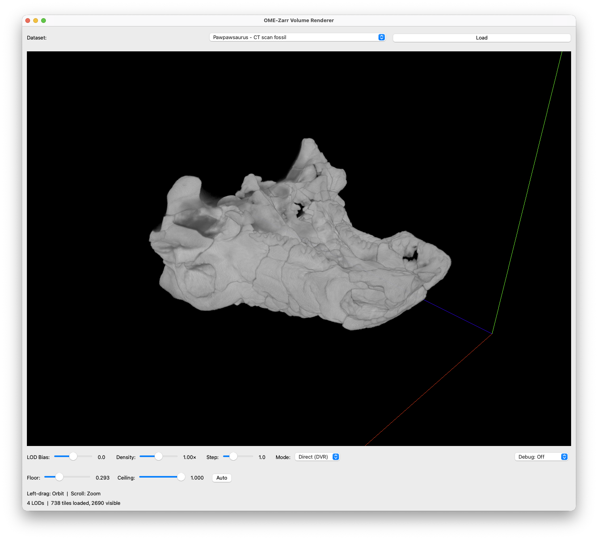
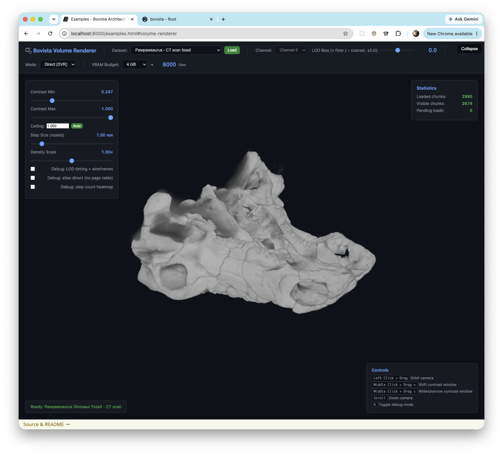

# Bovista

Bovista's thesis is simple: **write the core visualization once in Rust, run it anywhere.**

The same rendering engine — GPU resource management, LOD selection, virtual texture streaming, ray marching — compiles to a Python extension (via PyO3), a WebAssembly module (via wasm-bindgen), or a native Rust binary. There's no separate browser port or Python reimplementation. One codebase, three targets.

Built on [wgpu](https://wgpu.rs), which maps to Vulkan/Metal/DX12 on the desktop and WebGPU in the browser. The core library has no Python or browser dependencies — bindings are thin wrappers at the boundary.

Current capabilities:
- **Slice rendering** (`ImageVisual`): arbitrary-orientation plane intersection through 3D volumes
- **Volume ray marching** (`VolumeVisual`): direct volume rendering with transfer functions and colormap LUTs
- **Virtual texture streaming**: atlas + page table architecture; only the tiles in view are resident
- **Multi-resolution LOD**: coarse-to-fine pyramid, screen-space error-based selection
- **Remote OME-Zarr**: streams tiles from S3/HTTP, loads asynchronously via callback
- **Points and lines**: for annotations, axis helpers, point clouds

| Native (PyQt6) | Browser (WebAssembly) |
| :---: | :---: |
|  |  |
| `examples/volume_renderer/python/` | `examples/volume_renderer/web/` |

*Same renderer, same dataset, different host — both views are produced by the same Rust core.*

---

## Prerequisites

- **Rust** (stable) — [rustup.rs](https://rustup.rs)
- **uv** (Python package manager) — `curl -LsSf https://astral.sh/uv/install.sh | sh`
- **WASM only**: `wasm-bindgen-cli` — `cargo install wasm-bindgen-cli`

---

## Examples

Examples are organized by rendering mode, with parallel Python, Web, and Rust implementations in each:

```
examples/
  slice_viewer/     — arbitrary-orientation slice plane (ImageVisual)
    python/         — PyQt6 + ThreadPoolExecutor
    web/            — Browser + WebAssembly
    rust/           — stub (contributions welcome)
  volume_renderer/  — direct volume rendering via ray marching (VolumeVisual)
    python/
    web/
    rust/           — stub
```

**Python:**
```bash
uv sync              # Compiles Rust extension and installs Python deps
uv run python examples/slice_viewer/python/remote_ome_zarr.py
uv run python examples/volume_renderer/python/volume_ome_zarr.py
```

`uv sync` recompiles automatically when Rust source changes (tracked via `cache-keys` in `pyproject.toml`).

**Controls (volume example):**
- Left-drag: Orbit camera
- Scroll: Zoom
- LOD Bias / Density / Step / Contrast sliders in the UI

---

**Web (WASM):**
```bash
./build_wasm.sh                              # Compiles to WASM, outputs to examples/pkg/
python -m http.server 8000 --directory examples
open http://localhost:8000/slice_viewer/
```

The WASM build requires `wasm32-unknown-unknown` (the build script installs it automatically).

---

## Architecture

The core library is platform-agnostic Rust. Bindings add a thin layer at the edges.

```
src/
  lib.rs                    — crate root, public API
  renderer.rs               — wgpu device/queue, render pass
  camera.rs                 — orbit controls, frustum, projection
  scene.rs                  — collection of visuals
  visual.rs                 — Visual trait
  bindings_common.rs        — shared Python/WASM binding logic
  visuals/
    image.rs                — ImageVisual: slice-plane rendering
    volume.rs               — VolumeVisual: ray marching DVR
    virtual_texture.rs      — VirtualTextureData: atlas, page table, LOD
    atlas.rs                — AtlasAllocator: 3D texture atlas
    page_table.rs           — PageTable: 2D-array indirection texture
    gpu_structs.rs          — TileKey, TileData, TileLoaderFn, vertex/uniform structs
    points.rs               — PointsVisual
    lines.rs                — LinesVisual
    custom.rs               — CustomVisual (user-defined shaders)
  shaders/
    virtual_tile.wgsl       — slice shader (reads from atlas via page table)
    volume_raymarch.wgsl    — ray marching DVR shader
    point_cloud.wgsl
    lines.wgsl
  python.rs                 — PyO3 bindings (Viewer, Image, Volume, Lines, ...)
  wasm.rs                   — wasm-bindgen bindings

examples/
  slice_viewer/             — arbitrary-orientation slice plane
    python/                 — PyQt6 viewer
    web/                    — browser viewer (WebAssembly)
    rust/                   — stub
  volume_renderer/          — direct volume rendering
    python/
    web/
    rust/                   — stub
  pkg/                      — WASM build output (generated by build_wasm.sh, not committed)

kiln-render/                — standalone WebGPU browser volume renderer (TypeScript)
```

### Rendering pipeline (both ImageVisual and VolumeVisual)

Both renderers share the same virtual texture back-end:

1. **`VirtualTextureData::prepare()`** — per-frame LOD selection based on screen-space error; requests missing tiles via the loader callback
2. **Loader callback** (Python thread pool or JS fetch) — loads tile data asynchronously and calls `set_chunk_data_u16()` to push bytes into the pending queue
3. **`VirtualTextureData::upload_pending()`** — writes arrived tiles into the atlas 3D texture, updates the page table
4. **`ImageVisual::render()`** — single draw call; slice-plane geometry samples the atlas via the page table
5. **`VolumeVisual::render()`** — single draw call; back-face box geometry; fragment shader fires a ray per pixel and composites front-to-back through the atlas

---

## Python API (quick reference)

```python
import bovista as bv

viewer = bv.Viewer(800, 600)
viewer.initialize_with_window(handle, width, height)

# Volume ray marching
volume = bv.Volume(viewer, lod_levels, max_tiles=2000, loader=request)
volume.set_contrast(0.0, 1.0)
volume.set_density_scale(0.01)
volume.set_relative_step_size(1.0)
viewer.add(volume)

# Slice rendering
image = bv.Image(viewer, lod_levels, max_tiles=500, loader=request)
image.set_slice_plane(cx, cy, cz, nx, ny, nz)  # position + normal
viewer.add(image)

# Annotations
viewer.add(bv.Lines.axis_helper(viewer, 100.0))

# Render loop (called by Qt timer or similar)
viewer.render_frame()
```

LOD levels are described with `bv.LevelMetadata(volume_size, chunk_size, voxel_size, scale_factor, translation)`.

The loader callback signature is `(lod, z, y, x) -> ChunkStatus` where `ChunkStatus` is `Accepted`, `AlreadyPending`, or `Rejected`. Loaded data is pushed back via `volume.set_chunk_data_u16(lod, z, y, x, array)`.

---

## Development

```bash
# Fast type-check (no link)
cargo check

# Lint
cargo clippy

# Build Python extension in dev mode
uv run maturin develop --features python
```

---

## Related work

Bovista sits in the same neighborhood as a few other projects worth knowing about:

- **[pygfx](https://github.com/pygfx/pygfx)** — Python visualization library built on wgpu-py. Broad scene-graph API, multiple light types, materials, animation. Bovista is narrower (large multiscale image/volume data + virtual-texture streaming), but the wgpu-as-portable-GPU thesis is the same.
- **[kiln](https://github.com/MPanknin/kiln-render)** — Standalone TypeScript/WebGPU browser volume renderer. A checkout lives alongside this repo in `kiln-render/` as a cross-reference for the rendering approach.
